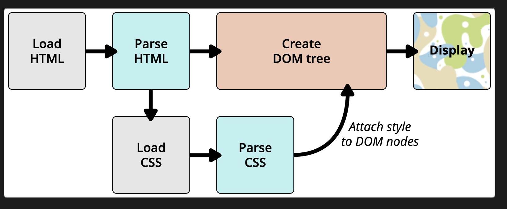

# Lesson 01 CSS First Steps

## 1.4 How CSS works

|[MDN-CSS](/README.md)|[Lesson 01](../readme.md)|[index.html](./index.html)|
|-|-|-|
---

## Overview

* [How Does CSS Works?](#how-does-css-works)
* [About the DOM](#about-the-dom)
* [A real DOM Representation](#a-real-dom-representation)
* [Applyin CSS to the Dom](#applyin-css-to-the-dom)
* [What Happens if browser Encounter CSS it Doesn't understand?](#what-happens-if-browser-encounter-css-it-doesnt-understand)
* [Summary](#summary)

|[Back to Top](#overview)|
|-|

---

## How Does CSS Works?

When a browser displays a document, it must combine the document's content with its style information. It processes the document in a number of stages, which we've listed below.       
Bear in mind that this is a very simplified version of what happens when a browser loads a webpage, and that different browsers will handle the process in different ways. But this is roughly what happens.        

1. The browser loads the HTML (e.g. receives it from the network).
2. It converts the HTML into a DOM (Document Object Model). The DOM represents the document in the computer's memory. The DOM is explained in a bit more detail in the next section.
3. The browser then fetches most of the resources that are linked to by the HTML document, such as embedded images, videos, and even linked CSS! JavaScript is handled a bit later on in the process, and we won't talk about it here to keep things simpler.
4. The browser parses the fetched CSS, and sorts the different rules by their selector types into different "buckets", e.g. element, class, ID, and so on. Based on the selectors it finds, it works out which rules should be applied to which nodes in the DOM, and attaches style to them as required (this intermediate step is called a render tree).
5. The render tree is laid out in the structure it should appear in after the rules have been applied to it.
6. The visual display of the page is shown on the screen (this stage is called painting).

The following diagram also offers a simple view of the process.

|[Back to Top](#overview)|
|-|

---

## About the DOM

A DOM has a tree-like structure. Each element, attribute, and piece of text in the markup language becomes a DOM node in the tree structure.    
>The nodes are defined by their relationship to other DOM nodes. Some elements are parents of child nodes, and child nodes have siblings.

Understanding the DOM helps you design, debug and maintain your CSS because the DOM is where your CSS and the document's content meet up. When you start working with browser DevTools you will be navigating the DOM as you select items in order to see which rules apply.

>Node (DOM) :-    
In the context of the DOM, a node is a single point in the node tree. Various things that are nodes are the document itself, elements, text, and comments.

|[Back to Top](#overview)|
|-|

---

## A real DOM Representation

|[Back to Top](#overview)|
|-|

---

## Applyin CSS to the Dom

|[Back to Top](#overview)|
|-|

---

## What Happens if browser Encounter CSS it Doesn't understand?

|[Back to Top](#overview)|
|-|

---

## Summary

|[Back to Top](#overview)|
|-|

---