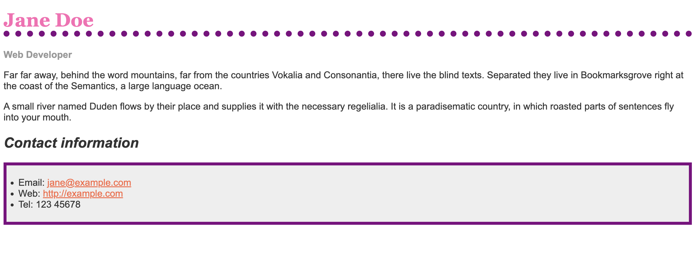
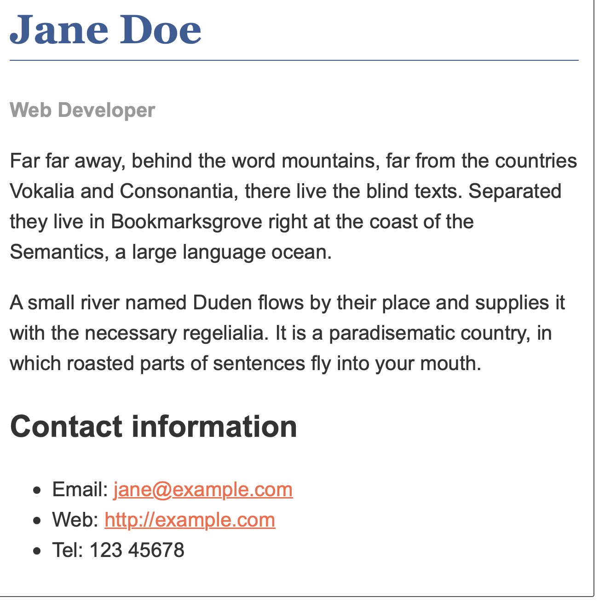

# Lesson 01 CSS First Steps

## 1.5 Styling a Biography Page - Assessment

|[MDN-CSS](/README.md)|[Lesson 01](../readme.md)|[index.html](./index.html)|
|-|-|-|
---

## Overview

1. [Starting Point](#1-starting-point)
1. [Project Brief](#2-project-brief)
1. [Hints And tips](#3-hints-and-tips)
1. [Example](#4-example)
1. [Assessment or Further help](#5-assessment-or-further-help)

|[Back to Top](#overview)|
|-|

---

## 1. Starting Point

You can work in the live editor below, or you can [download the starting point file](https://github.com/mdn/css-examples/blob/main/learn/getting-started/biog-download.html) to work with in your own editor. This is a single page containing both the HTML and the starting point CSS (in the head of the document). If you prefer you could move this CSS to a separate file and link to it when you create the example on your local computer.

Alternatively use an online tool such as [CodePen](https://codepen.io), [jsFiddle](https://jsfiddle.net), or [Glitch](https://glitch.com) to work on the tasks.


|[Back to Top](#overview)|
|-|

---

## 2. Project Brief

The following live example shows a biography, which has been styled using CSS. The CSS properties that are used are as follows — each one links to its property page on MDN, which will give you more examples of its use.

* [font-family](https://developer.mozilla.org/en-US/docs/Web/CSS/font-family)
* [color](https://developer.mozilla.org/en-US/docs/Web/CSS/color)
* [border-bottom](https://developer.mozilla.org/en-US/docs/Web/CSS/border-bottom)
* [font-weight](https://developer.mozilla.org/en-US/docs/Web/CSS/font-weight)
* [font-size](https://developer.mozilla.org/en-US/docs/Web/CSS/font-size)
* [font-style](https://developer.mozilla.org/en-US/docs/Web/CSS/font-style)
* [text-decoration](https://developer.mozilla.org/en-US/docs/Web/CSS/text-decoration)

In the interactive editor you will find some CSS already in place. This selects parts of the document using element selectors, classes, and pseudo-classes. Make the following changes to this CSS:

1. Make the level one heading pink, using the CSS color keyword hotpink.
2. Give the heading a 10px dotted [border-bottom](https://developer.mozilla.org/en-US/docs/Web/CSS/border-bottom) which uses the CSS color keyword purple.
```
h1 {
    /* color: #375e97; */
    color: hotpink;
    
    font-size: 2em;
    font-family: Georgia, 'Times New Roman', Times, serif;
    
    /* border-bottom: 1px solid #375e97; */
    border-bottom: 10px dotted purple;
  }
```
3. Make the level 2 heading italic.
4. Give the ul used for the contact details a [background-color](https://developer.mozilla.org/en-US/docs/Web/CSS/background-color) of #eeeeee, and a 5px solid purple [border](https://developer.mozilla.org/en-US/docs/Web/CSS/border). Use some [padding](https://developer.mozilla.org/en-US/docs/Web/CSS/padding) to push the content away from the border.
```
h2 {
    font-size: 1.5em;
    font-style: italic;
  }
  ul{
    background-color: #eee;
    border: 5px solid purple;
    padding: 20px;
  }
```
5. Make the links green on hover.
```
a:hover {
    text-decoration: none;
    color: green;
  }
```


|[Back to Top](#overview)|
|-|

---

## 3. Hints And tips

* Use the [W3C CSS Validator](https://jigsaw.w3.org/css-validator/) to catch unintended mistakes in your CSS — mistakes you might have otherwise missed — so that you can fix them.
* Afterwards try looking up some properties not mentioned on this page in the [MDN CSS reference](https://developer.mozilla.org/en-US/docs/Web/CSS/Reference) and get adventurous!
* Remember that there is no wrong answer here — at this stage in your learning you can afford to have a bit of fun.


|[Back to Top](#overview)|
|-|

---

## 4. Example

You should end up with something like this image.





[My CSS Source](style.css)

|[Back to Top](#overview)|
|-|

---

## 5. Assessment or Further help

If you would like your work assessed or are stuck and want to ask for help:

1. Put your work into an online shareable editor such as CodePen, jsFiddle, or Glitch.
2. Write a post asking for assessment and/or help at the MDN Discourse forum Learning category. Your post should include:
    * A descriptive title such as "Assessment wanted for Styling a biography page".
    * Details of what you have already tried and what you would like us to do; for example, tell us if you're stuck and need help or want an assessment.
    * A link to the example you want assessed or need help with, in an online shareable editor (as mentioned in step 1 above). This is a good practice to get into — it's very hard to help someone with a coding problem if you can't see their code.
    * A link to the actual task or assessment page, so we can find the question you want help with.

|[Back to Top](#overview)|
|-|

---